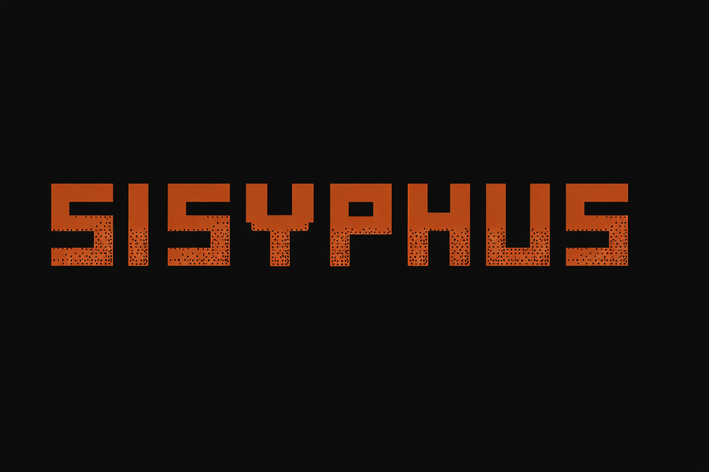

# Sisyphus

<p align="center">
  
</p>

<p align="center">
  <strong>A robust, open-source general-purpose AI agent framework</strong>
</p>

<p align="center">
  <a href="LICENSE">
    
  </a>
  <a href="https://rust-lang.org">
    
  </a>
  <a href="https://codecov.io/gh/your-org/sisyphus">
    
  </a>
</p>

<p align="center">
  <em>"The struggle itself toward the heights is enough to fill a man's heart."</em><br>
  — Albert Camus
</p>

---

## 📖 About

**Sisyphus** is a general-purpose AI agent framework ported from the core logic of [OpenCode](https://opencode.ai). It is designed to be a flexible, headless, and extensible system for building AI agents that can interact with the world through tools and APIs.

Sisyphus focuses on providing a high-performance agent runtime that can power various clients (CLI, IDE extensions, Web) while maintaining a strict separation between the core logic and the user interface.

> **Note**: This project is currently in early active development (Phase 1).

### Core Principles

1.  **Provider Agnostic** - Unified API for multiple LLM providers (OpenAI, Anthropic, Google, Local).
2.  **Extensible** - Universal tooling system with MCP (Model Context Protocol) support.
3.  **Headless by Design** - Decoupled architecture allowing multiple client interfaces (CLI, VS Code, Web).
4.  **High Performance** - Built in Rust for speed, safety, and efficiency.

## 🎯 Scope

### In Scope
*   **Core Agent Logic**: Versatile agents for planning and executing tasks.
*   **Session Management**: Context compaction, history tracking, and persistence.
*   **Universal Tooling**: Shell, File System, and MCP integration.
*   **Server Architecture**: HTTP/WebSocket API for remote clients.
*   **CLI Entry Point**: Headless CLI for running the server or executing specific commands.
*   **Terminal User Interface (TUI)**: Optional interactive TUI for chat sessions (via `--features tui`).

### Out of Scope
*   **Desktop/Web Wrappers**: Specific frontend implementations (Electron, Tauri, React).

## 🏗️ Architecture

Sisyphus uses a **Cargo Workspace** architecture:

```
sisyphus/
├── crates/
│   ├── common/      # Shared utilities, traits, event bus
│   ├── core/        # Agent logic, session management, memory
│   ├── provider/    # LLM provider adapters
│   ├── tools/       # Standard tools (fs, shell)
│   ├── server/      # HTTP/WebSocket API server
│   ├── cli/         # CLI entry point
 │   ├── cli-core/    # Shared CLI library (commands, REPL, completer)
│   └── tui/         # Optional TUI frontend (requires `--features tui`)
└── Cargo.toml       # Workspace configuration
```

## ✨ Features

### Current Capabilities
-   **Interactive CLI**: Chat with the agent directly in your terminal.
-   **Optional TUI**: Rich interactive terminal UI for chat sessions (build with `--features tui`).
-   **LLM Support**:
    -   OpenAI (GPT-4, etc.)
    -   Mock Provider (for testing)
-   **Tools**:
    -   **Shell Execution**: Run system commands safely.
    -   **File System**: Read and write files within a sandboxed environment.
-   **Reasoning Process**: View the model's internal thinking process (toggle with `/think`).
-   **Event System**: Internal event bus for observability.

### Planned Features
-   **Advanced Agent System**:
    -   **Executor Agent**: Capable of executing commands and editing files.
    -   **Planner Agent**: Specialized for analysis, strategy, and research.
    -   **Sub-agents**: Triage, Researcher, Data Analyst.
-   **Session Management**:
    -   Conversation history with context compaction.
    -   Session persistence (save/load).
-   **Skills System**:
    -   Declarative skills via `SKILL.md`.
    -   Dynamic skill injection and discovery.
-   **MCP Support**: Native integration with Model Context Protocol (Web Search, Database, APIs).
-   **Internationalization (i18n)**: Multi-language support for system messages.

## 🚀 Quick Start

### Prerequisites

-   Rust 1.75 or higher
-   Cargo package manager

### Installation

```bash
# Clone the repository
git clone https://github.com/your-org/sisyphus.git
cd sisyphus

# Build the project
cargo build --release
```

### Configuration

Create a `.env` file in the project root:

```env
# LLM Provider Configuration
LLM_PROVIDER=openai
OPENAI_API_KEY=your-api-key

# Optional
LLM_MODEL=gpt-4
# LLM_BASE_URL=...
```

### Usage

Run the CLI in chat mode:

```bash
cargo run --release --bin sisyphus
```

Or with the TUI (rich interactive terminal interface):

```bash
cargo run --release --bin sisyphus --features tui
sisyphus chat --tui
```

Or if installed:

```bash
sisyphus chat
```

## 📚 Documentation

-   **[PRD.md](PRD.md)** - Product requirements and feature specifications.
-   **[AGENTS.md](AGENTS.md)** - Development guidelines and agent instructions.

## 🛠️ Development

### Building and Testing

```bash
# Build CLI-only (default)
cargo build --release

# Build with TUI support
cargo build --release --features tui

# Run all tests
cargo test
```

### Running Coverage

Generate coverage report locally:

```bash
# Run coverage script (generates HTML and XML reports)
./scripts/coverage.sh

# Or run tarpaulin directly
cargo tarpaulin --workspace --out Html --out Xml
```

Coverage reports are generated in `target/tarpaulin/`. To view the HTML report:

```bash
open target/tarpaulin/index.html  # macOS
xdg-open target/tarpaulin/index.html  # Linux
```

CI/CD automatically runs tests and uploads coverage to Codecov on every push and PR.

### Adding a New Tool

1.  Implement the `Tool` trait in `crates/tools/src/`.
2.  Register the tool in `crates/tools/src/lib.rs`.
3.  Add it to the agent in `crates/cli/src/main.rs`.

## 📄 License

This project is licensed under the Apache License, Version 2.0 - see the [LICENSE](LICENSE) file for details.

## 🙏 Acknowledgments

-   **OpenCode** - Core logic and inspiration.
-   **Rust Community** - For the amazing ecosystem.
