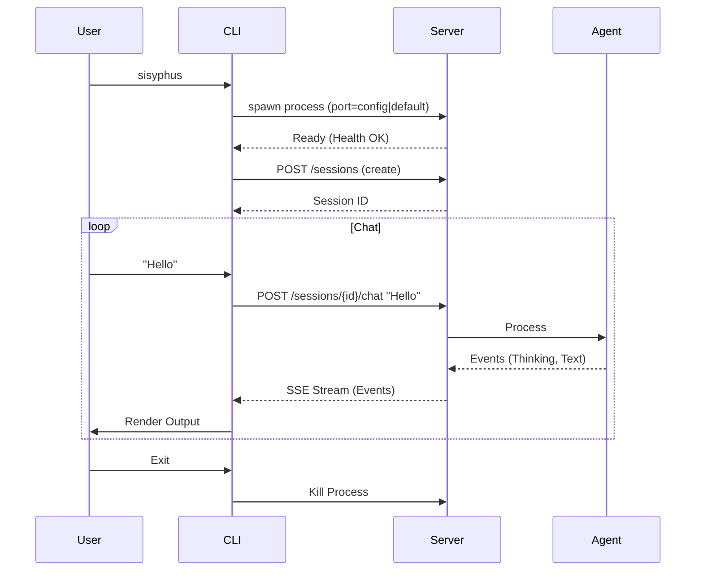

# Design: CLI Client-Server Architecture

## Overview
The Sisyphus CLI will be refactored to remove monolithic agent execution. Instead, it will strictly act as a client to the `sisyphus-server`.

## Architecture

### Components
1.  **CLI (Client)**:
    -   Responsible for TUI/Output rendering.
    -   Manages server lifecycle (spawn/connect/kill).
    -   Uses HTTP/SSE to communicate with the server.
2.  **Server (Core)**:
    -   Hosts the `Agent`, `SessionManager`, and `EventBus`.
    -   Exposes REST endpoints for actions and SSE for events.
    -   Runs in a separate process (or thread in some modes, but process preferred for isolation).
3.  **Client SDK** (`crates/client`):
    -   Rust library wrapping the HTTP API.
    -   Provides typed methods for `chat`, `list_sessions`, `subscribe_events`.

### Workflow
1.  User runs `sisyphus`.
2.  CLI checks command:
    -   If `attach <url>`, connects to that URL.
    -   If no subcommand, spawns `sisyphus serve`.
        -   Checks config for port, or uses default (e.g., 3000).
        -   If port is busy or 0, binds to random port.
3.  CLI waits for Server readiness (health check).
4.  CLI creates a `Client` instance.
5.  CLI enters interaction loop:
    -   **Input**: Sends `POST /api/v1/sessions/{id}/chat`.
    -   **Output**: Listens to `GET /api/v1/events` (SSE) for `MessagePart`, `ToolUse`, etc.
6.  On Exit (Ctrl+C):
    -   If spawned locally, CLI kills the Server process.

## Data Flow

## Technical Decisions
-   **Communication**: HTTP + Server-Sent Events (SSE).
    -   *Why?* Standard, easy to debug, matches OpenCode.
-   **Process Management**: `tokio::process::Command`.
    -   *Why?* Async, integrates with Tokio runtime.
-   **SDK**: New crate `sisyphus-client`.
    -   *Why?* Reusable for future TUI or other tools.

## OpenCode Alignment
-   Matches `opencode run` and `opencode tui` architecture.
-   Enables "Headless" mode naturally.
